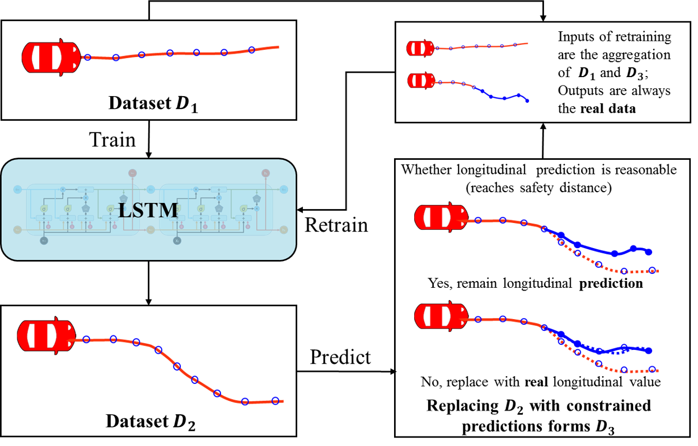
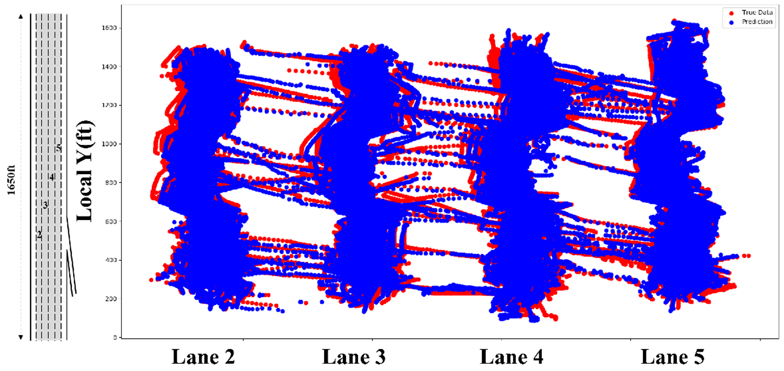
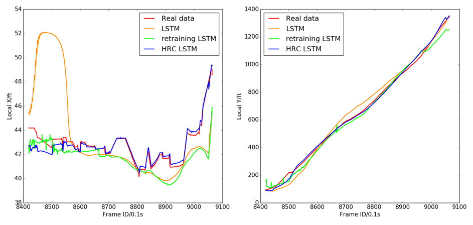

My research in traffic flow theory and simulation focuses on bridging the fundamental gap between microscopic driving behaviors and macroscopic traffic flow properties through analytical modeling approaches and advance data-driven techniques to accurately reproduce human driving behaviors. The central challenge I address is understanding and quantifying the inherent stochasticity in traffic systems, where individual driver behaviors create uncertainty that propagates through the entire traffic network. Rather than treating traffic flow as deterministic, my work develops mathematical frameworks that explicitly account for the probabilistic nature of driving decisions and their collective impact on system-level performance.

<h3> Integrated Behavior Modeling Through Deep Learning</h3>

I have developed Long Short-Term Memory neural networks that simultaneously model car-following and lane-changing behaviors by observing only the positions of surrounding vehicles. This represents a fundamental shift from conventional approaches that model these behaviors separately. The LSTM architecture automatically extracts relevant features and captures the temporal dynamics of traffic interactions, while my Hybrid Retraining Constrained training method further optimizes performance. 

Validation with real-world trajectory data demonstrates superior accuracy compared to classical models and excellent transferability across different traffic environments.

<h3> Analytical Micro-Macroscopic Modeling</h3>

Traditional traffic flow models have struggled to connect individual driving behaviors with aggregate traffic patterns in a mathematically rigorous way. I have developed the Leader-Follower Conditional Distribution-based Stochastic Traffic Modeling framework that provides this crucial analytical link. Through probabilistic modeling of leader-follower interactions using Brownian dynamics, I establish a general mathematical representation that encompasses the longitudinal interactions between vehicles while remaining compatible with classical car-following theories. 

This approach describes the joint distribution of vehicle speeds within traffic platoons through Markov chain modeling, creating a mathematical pathway from individual behavioral uncertainty to system-wide flow characteristics. The framework provides analytical derivations of macroscopic traffic relations, including both mean flow-density relationships and their associated variances under equilibrium conditions. This represents a fundamental advancement in traffic flow theory by providing closed-form mathematical expressions that connect microscopic stochasticity to macroscopic uncertainty.

<h3> Stochastic Fundamental Diagram</h3>

My primary contribution lies in developing analytical models for the Stochastic Fundamental Diagram, which captures the inherent variability in traffic flow relationships that traditional deterministic models cannot explain. While previous research has attempted to reproduce stochastic traffic patterns through various empirical methods, my work provides the first comprehensive analytical framework for understanding why and how this stochasticity emerges from underlying driving behaviors. 
Using maximum entropy principles within my micro-macroscopic framework, I derive theoretical expressions for both the mean and variance of fundamental traffic flow relationships. This maximum entropy approach provides specific conditional distributions for longitudinal vehicle interactions, enabling the solution of analytical functions that describe traffic flow uncertainty. The resulting model quantifies how individual driver variability compounds into system-level unpredictability, providing insights into the fundamental nature of traffic flow stochasticity.

<h3> Theoretical Validation and Practical Implications</h3>

Through comprehensive validation using multiple real-world datasets including NGSIM I-80, US-101, and HighD trajectories, I demonstrate remarkable consistency between theoretical predictions and empirical observations. This validation confirms both the mathematical soundness of the Leader-Follower Conditional Distribution framework and the practical accuracy of the maximum entropy-based Stochastic Fundamental Diagram model. 
The theoretical insights from this work have direct implications for traffic management and control strategies. By understanding how microscopic behavioral variations propagate to macroscopic flow uncertainty, the model provides guidance for developing interventions that promote smoother driving behaviors to suppress stochasticity and improve overall traffic flow efficiency. This represents a shift from reactive traffic management toward predictive strategies based on fundamental understanding of traffic flow uncertainty.

<h3> Research Impact and Contribution</h3>

My work establishes a new paradigm in traffic flow theory by providing the mathematical tools to analytically connect individual driving behaviors with system-level traffic performance under uncertainty. This bridges a critical gap that has limited the development of robust traffic control strategies and provides a theoretical foundation for understanding complex traffic phenomena. The analytical nature of the framework enables deeper insights into traffic dynamics than purely empirical approaches, while the validation with real-world data ensures practical relevance. 
The Leader-Follower Conditional Distribution framework represents a general analytical tool that can be applied to various traffic scenarios and extended to incorporate different behavioral models. This flexibility, combined with the rigorous mathematical foundation, positions the work as a significant contribution to both theoretical traffic flow research and practical transportation engineering applications.

<h3> References</h3>

<cite><ul> 
<li><b>Zhang, X.</b>, Sun, Jie, Sun, Jian, 2025. On the stochastic fundamental diagram: A general micro-macroscopic traffic flow modeling framework. Communications in Transportation Research 5, 100163.<li>
<li><b>Zhang, X.</b>, Sun, Jie, Qi, X., Sun, Jian, 2019. Simultaneous modeling of car-following and lane-changing behaviors using deep learning. Transportation Research Part C: Emerging Technologies 104, 287–304.</li>
</ul></cite>  

<!-- scikit-learn is a Python module for machine learning built on top of SciPy and is distributed under the 3-Clause BSD license. -->

<!--more-->
